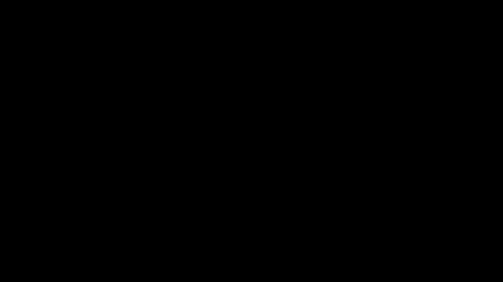
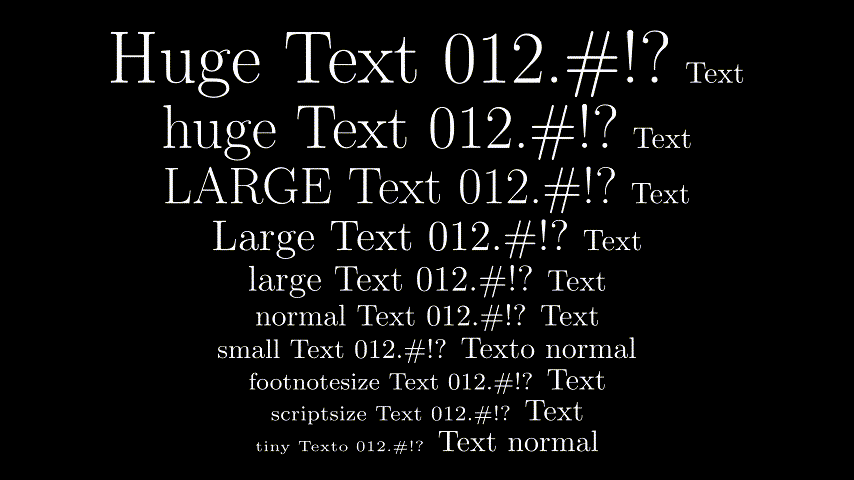

# Tutorial de Manim - Animaciones Matemáticas

Este documento contiene ejemplos de código Manim con sus respectivas animaciones.

---

## 1. Escribir Texto Básico

### Escribir texto con animación

```python
from manim import *

class escribirtexto(Scene): 
    def construct(self): 
        text = Text("This is a regular text")
        self.play(Write(text))
        self.wait(3)
```

<p align="center"></p>

### Agregar texto sin animación

```python
class hola(Scene):
    def construct(self):
        texto=Text("hecho con add")
        self.add(texto)
        self.wait(3)
```


## 2. Fórmulas Matemáticas

### Fórmula con LaTeX y animaciones

```python
class Formula(Scene):
    def construct(self):
        accion=MathTex("""ds= \\sqrt{g_{ij}\\frac{d x^i}{d\\tau} \\frac{d x^j}{d\\tau} } d\\tau  """)
        self.play(Write(accion))
        self.wait(2)
        self.play(accion.animate.to_corner(UL, buff=0.4).scale(0.6), run_time=2)
        self.wait(1)
        
        lagrangiano_s = MathTex(""" \\mathcal{L}=\\frac{1}{2}\\left \\{\\left(1 - \\frac{2M}{r}  \\right)\\dot{t}^2 -\\frac{\\dot{r}^2}{1-\\frac{2M}{r}} - r^2\\dot{\\theta}^2 -(r^2 \\sin^2 \\theta)\\dot{\\phi^2}      \\right \\} """)
        self.play(Write(lagrangiano_s))
        self.wait(2)
        self.play(lagrangiano_s.animate.scale(0.6).next_to(accion, RIGHT, aligned_edge=LEFT, buff=1.8), run_time=2)
        self.wait(2)

        canon=Text("Los Canonical Momenta")
        self.play(Write(canon))
        self.wait(2)
        coor_dots=MathTex("""\\dot{t}= \\frac{d t}{d \\tau}, \\quad \\dot{r}=\\frac{d r}{d \\tau}, \\quad \\dot{\\theta}= \\frac{d \\theta}{d \\tau}, \\quad \\dot{\\phi}= \\frac{d \\phi}{d \\tau} """)
        self.play(coor_dots.animate.next_to(canon, DOWN, buff=0.5))
        self.wait(2)
        can_mom=MathTex("""p_t= \\partial_{\\dot{t}}\\mathcal{L}= \\left(1 - \\frac{2M}{r}  \\right)\\dot{t}, \\quad p_r=-\\partial_{\\dot{r}}\\mathcal{L}=\\left(1 - \\frac{2M}{r}  \\right)^{-1} \\dot{r},
                        \\quad p_{\\phi}=-\\partial_{\\dot{\\phi}} \\mathcal{L}=\\left(r^2 \\sin^{2}\\theta \\right)\\dot{\\phi}, \\quad p_{\\theta}=-\\partial_{\\theta}\\mathcal{L}=r^2\\dot{\\theta}""")
        
        can_mom.animate.scale(0.6).next_to(coor_dots, DOWN, buff=0.5)
        self.play(Write(can_mom))
        self.wait(2)
```

<p align="center"></p>

### Mostrar fórmulas en texto

```python
class DisplayFormula(Scene): 
    def construct(self): 
        typesOfText = Text("""
            This is a regular text,
            $\\displaystyle\\frac{x}{y}$,
            $$x^2+y^2=a^2$$
            """)
        self.play(Write(typesOfText))
        self.wait(3)
```

<p align="center"></p>
---

## 3. Fuentes y Estilos de Texto

### Diferentes fuentes LaTeX

```python
class TextFonts(Scene):
    def construct(self):
        textNormal = Tex("\\textrm{Roman serif text 012.\\#!?} Text")
        textItalic = Tex("\\textit{Italic text 012.\\#!?} Text")
        textTypewriter = Tex("\\texttt{Typewritter text 012.\\#!?} Text")
        textBold = Tex("\\textbf{Bold text 012.\\#!?} Text")
        textSL = Tex("\\textsl{Slanted text 012.\\#!?} Text")
        textSC = Tex("\\textsc{Small caps text 012.\\#!?} Text")
        textNormal.to_edge(UP)
        textItalic.next_to(textNormal,DOWN,buff=.5)
        textTypewriter.next_to(textItalic,DOWN,buff=.5)
        textBold.next_to(textTypewriter,DOWN,buff=.5)
        textSL.next_to(textBold,DOWN,buff=.5)
        textSC.next_to(textSL,DOWN,buff=.5)
        self.add(textNormal,textItalic,textTypewriter,textBold,textSL,textSC)
        self.wait(3)
```

<p align="center"></p>

---

## 4. Tamaños de Texto

### Diferentes tamaños en LaTeX

```python
class SizeTextOnLaTeX(Scene):
    def construct(self):
        textHuge = Tex("{\\Huge Huge Text 012.\\#!?} Text")
        texthuge = Tex("{\\huge huge Text 012.\\#!?} Text")
        textLARGE = Tex("{\\LARGE LARGE Text 012.\\#!?} Text")
        textLarge = Tex("{\\Large Large Text 012.\\#!?} Text")
        textlarge = Tex("{\\large large Text 012.\\#!?} Text")
        textNormal = Tex("{\\normalsize normal Text 012.\\#!?} Text")
        textsmall = Tex("{\\small small Text 012.\\#!?} Texto normal")
        textfootnotesize = Tex("{\\footnotesize footnotesize Text 012.\\#!?} Text")
        textscriptsize = Tex("{\\scriptsize scriptsize Text 012.\\#!?} Text")
        texttiny = Tex("{\\tiny tiny Texto 012.\\#!?} Text normal")
        textHuge.to_edge(UP)
        texthuge.next_to(textHuge,DOWN,buff=0.1)
        textLARGE.next_to(texthuge,DOWN,buff=0.1)
        textLarge.next_to(textLARGE,DOWN,buff=0.1)
        textlarge.next_to(textLarge,DOWN,buff=0.1)
        textNormal.next_to(textlarge,DOWN,buff=0.1)
        textsmall.next_to(textNormal,DOWN,buff=0.1)
        textfootnotesize.next_to(textsmall,DOWN,buff=0.1)
        textscriptsize.next_to(textfootnotesize,DOWN,buff=0.1)
        texttiny.next_to(textscriptsize,DOWN,buff=0.1)
        self.add(textHuge,texthuge,textLARGE,textLarge,textlarge,textNormal,textsmall,textfootnotesize,textscriptsize,texttiny)
        self.wait(3)
```

<p align="center"></p>
---

## 5. Posicionamiento y Rotación

### Posición relativa

```python
class RelativePosition1(Scene):
    def construct(self):
        textM = Tex("Text")
        textC = Tex("Reference text")
        textM.next_to(textC,LEFT,buff=1) 
        self.play(Write(textM),Write(textC))
        self.wait(3)
```

<p align="center"></p>

### Rotar objetos

```python
class RotateObject(Scene):
    def construct(self):
        textM = Text("Text")
        textC = Text("Reference text")
        textM.shift(UP)
        textM.rotate(PI/4) # <- Radians
        # You can use .rotate(45*DEGREES) too
        self.play(Write(textM),Write(textC))
        self.wait(2)
        textM.rotate(PI/4)
        self.wait(2)
        textM.rotate(PI/4)
        self.wait(2)
        textM.rotate(PI/4)
        self.wait(2)
        textM.rotate(PI)
        self.wait(2)
```

<p align="center"></p>


### Mover texto a diferentes posiciones

```python
class movertexto(Scene):
    def construct(self):
        text = Text("Text")
        self.play(Write(text))
        self.wait(1)
        self.play(text.animate.to_edge(UP), run_time=2)
        self.wait(1)
        self.play(text.animate.to_edge(UL), run_time=2)
        self.wait(1)
        self.play(text.animate.to_edge(DL), run_time=2)
        self.wait(1)
        self.play(text.animate.to_edge(DR), run_time=2)
        self.wait(1)
        self.play(text.animate.center(), run_time=2)
        self.wait(1)
```

<p align="center"></p>

---

## 6. Colores

### Texto con colores individuales

```python
COLOR_P="#3EFC24"

class TextColor(Scene):
    def construct(self):
        text = Tex("A","B","C", "D", "E", "F")
        text[0].set_color(RED)
        text[1].set_color(BLUE)
        text[2].set_color(GREEN)
        text[3].set_color(ORANGE)
        text[4].set_color("#DC28E2") #Hexadecimal color
        text[5].set_color(COLOR_P)
        self.play(Write(text))
        self.wait(2)
```

<p align="center"></p>

### Fórmulas con colores

```python
class FormulaColor2(Scene): 
    def construct(self): 
        text = Tex("x","=","\\frac{a}{b}")
        text[0].set_color(RED)
        text[1].set_color(BLUE)
        text[2].set_color(GREEN)
        self.play(Write(text))
        self.wait(2)
```


### Colorear partes específicas con mapeo

```python
class Color_letras(Scene):
    def construct(self):
        text = MathTex(r"\frac{d}{d{x}}\int_{{a}}^{{x}} f(t)\,dt = f({x})",
            tex_to_color_map={
                "{x}": RED,
                "{a}": BLUE,
            })

        self.play(Write(text))
        self.wait(2)
```

<p align="center"></p>
---

## 7. Elementos Gráficos sobre Fórmulas

### Tachar texto

```python
class CrossText2(Scene):
    def construct(self):
        text = MathTex(r"\sum_{i=1}^{\infty} i", "=", r"-\frac{1}{2}")

        eq = VGroup(text[1], text[2])
        cross = Cross(eq)
        cross.set_stroke(RED, 6)

        self.play(Write(text))
        self.wait(0.5)
        self.play(Create(cross))
        self.wait(2)
```

<p align="center"></p>

### Recuadro alrededor de fórmulas

```python
class FrameBox2(Scene):
    def construct(self):
        text = MathTex(
            r"\hat g(", "f", ")", "=",
            r"\int", r"_{t_1}", r"^{t_2}",
            r"g(", "t", ")", "e",
            r"^{-2\pi i", "f", "t}", "dt"
        )

        seleccion = VGroup(text[4], text[5], text[6])

        frameBox = SurroundingRectangle(
            seleccion,
            buff=0.5 * SMALL_BUFF
        )
        frameBox.set_stroke(GREEN, 9)

        self.play(Write(text))
        self.wait(0.5)
        self.play(Create(frameBox))
        self.wait(2)
```

<p align="center"></p>

### Llaves con texto

```python
class BraceText(Scene):
    def construct(self):
        text=MathTex(
            "\\frac{d}{dx}f(x)g(x)=","f(x)\\frac{d}{dx}g(x)","+",
            "g(x)\\frac{d}{dx}f(x)"
        )
        self.play(Write(text))
        brace_top = Brace(text[1], UP, buff = SMALL_BUFF)
        brace_bottom = Brace(text[3], DOWN, buff = SMALL_BUFF)
        text_top = brace_top.get_text("$g'f$")
        text_bottom = brace_bottom.get_text("$f'g$")
        self.play(
            GrowFromCenter(brace_top),
            GrowFromCenter(brace_bottom),
            FadeIn(text_top),
            FadeIn(text_bottom)
            )
        self.wait()
```

<p align="center"></p>

---

## 8. Transformaciones y Copias

### Copiar y transformar elementos (versión 2)

```python
class CopyTextV2(Scene):
	def construct(self):
		formula = MathTex("\\frac{d}{dx}",
			"(","u","+","v",")","=",
			"\\frac{d}{dx}","u","+","\\frac{d}{dx}","v"
			)
		formula.scale(2)
		self.play(Write(formula[0:7]))
		self.wait()
		self.play(
			ReplacementTransform(formula[2].copy(),formula[8]),
			ReplacementTransform(formula[4].copy(),formula[11]),
			ReplacementTransform(formula[3].copy(),formula[9]),
			run_time=3
			)
		self.wait()
		self.play(
			ReplacementTransform(formula[0].copy(),formula[7]),
			ReplacementTransform(formula[0].copy(),formula[10]),
			run_time=3
			)
		self.wait()
```

<p align="center"></p>

### Copiar y transformar con colores (versión 3)

```python
class CopyTextV3(Scene):
	def construct(self):
		formula = MathTex("\\frac{d}{dx}",
			"(","u","+","v",")","=",
			"\\frac{d}{dx}","u","+","\\frac{d}{dx}","v"
			)
		formula.scale(2)
		formula[8].set_color(RED)
		formula[11].set_color(BLUE)
		self.play(Write(formula[0:7]))
		self.wait()
		self.play(
			ReplacementTransform(formula[2].copy(),formula[8]),
			ReplacementTransform(formula[4].copy(),formula[11]),
			ReplacementTransform(formula[3].copy(),formula[9]),
			run_time=3
			)
		self.wait()
		self.play(
			ReplacementTransform(formula[0].copy(),formula[7]),
			ReplacementTransform(formula[0].copy(),formula[10]),
			run_time=3
			)
		self.wait()
```


<p align="center"></p>

### Solución infalible para transformaciones

```python
class TransformIssuesSolutionInfallible(Scene):
	def construct(self):
		#                   0   1   2
		text_1=MathTex("A","B","C")
		#                   0
		text_2=MathTex("B")

		text_2.next_to(text_1,UP,buff=1)

		#Create a copy of the objects

		text_1_1_c=MathTex("B")\
				   .match_style(text_1[1])\
				   .match_width(text_1[1])\
				   .move_to(text_1[1])

		#Add the elements 0 and 2 of text_1 to screen and text_2
		self.play(*[
						FadeIn(text_1[i])
						for i in [0,2]
					],
					FadeIn(text_2)
			)

		self.wait()

		self.play(
					# Add [:] to the firts or second parameter
					ReplacementTransform(text_2,text_1_1_c)
			)
		self.remove(text_1_1_c)
		self.add(text_1[1])

		self.wait()
```

<p align="center"></p>

---

## 9. Recuadros Móviles

### Mover recuadro simple

```python
class MoveFrameBox(Scene):
    def construct(self):
        text=MathTex(
            "\\frac{d}{dx}f(x)g(x)=","f(x)\\frac{d}{dx}g(x)","+",
            "g(x)\\frac{d}{dx}f(x)"
        )
        self.play(Write(text))
        framebox1 = SurroundingRectangle(text[1], buff = .1)
        framebox2 = SurroundingRectangle(text[3], buff = .1)
        self.play(
            Create(framebox1),
            )
        self.wait()
        self.play(
        	ReplacementTransform(framebox1,framebox2),
        	)
        self.wait()
```

<p align="center"></p>


### Copiar recuadro

```python
class MoveFrameBoxCopy(Scene):
    def construct(self):
        text=MathTex(
            "\\frac{d}{dx}f(x)g(x)=","f(x)\\frac{d}{dx}g(x)","+",
            "g(x)\\frac{d}{dx}f(x)"
        )
        self.play(Write(text))
        framebox1 = SurroundingRectangle(text[1], buff = .1)
        framebox2 = SurroundingRectangle(text[3], buff = .1)
        self.play(Create(framebox1))
        self.wait()
        self.play(
        	ReplacementTransform(framebox1.copy(),framebox2),
        	path_arc=-np.pi
        	)
        self.wait()
```

<p align="center"></p>
### Recuadro con etiquetas

```python
class MoveFrameBoxCopy2(Scene):
    def construct(self):
        text = MathTex(
            r"\frac{d}{dx}f(x)g(x)=",
            r"f(x)\frac{d}{dx}g(x)",
            "+",
            r"g(x)\frac{d}{dx}f(x)"
        )

        self.play(Write(text))
        self.wait(0.5)

        framebox1 = SurroundingRectangle(text[1], buff=0.1)
        framebox2 = SurroundingRectangle(text[3], buff=0.1)

        t1 = MathTex(r"g'f")
        t2 = MathTex(r"f'g")

        t1.next_to(framebox1, UP, buff=0.1)
        t2.next_to(framebox2, UP, buff=0.1)

        # Aparece el primer recuadro + texto
        self.play(
            Create(framebox1),
            FadeIn(t1)
        )
        self.wait(1)

        # Se mueve/copía al segundo término
        self.play(
            ReplacementTransform(framebox1.copy(), framebox2),
            ReplacementTransform(t1.copy(), t2)
        )
        self.wait(2)
```

<p align="center"></p>
---

## 10. Flechas y Líneas

### Flechas entre objetos

```python
class Arrow2(Scene):
	def construct(self):
		step1 = MathTex("Step 1")
		step2 = MathTex("Step 2")
		step1.move_to(LEFT*2+DOWN*2)
		step2.move_to(4*RIGHT+2*UP)
		arrow1 = Arrow(step1.get_right(),step2.get_left(),buff=0.1)
		arrow1.set_color(RED)
		arrow2 = Arrow(step1.get_top(),step2.get_bottom(),buff=0.1)
		arrow2.set_color(BLUE)
		self.play(Write(step1),Write(step2))
		self.play(GrowArrow(arrow1))
		self.play(GrowArrow(arrow2))
		self.wait()
```

<p align="center"></p>
### Líneas simples

```python
class LineAnimation(Scene):
    def construct(self):
        step1 = MathTex("Step 1")
        step2 = MathTex("Step 2")
        step1.move_to(LEFT*2+DOWN*2)
        step2.move_to(4*RIGHT+2*UP)
        arrow1 = Line(step1.get_right(),step2.get_left(),buff=0.1)
        arrow1.set_color(RED)
        arrow2 = Line(step1.get_top(),step2.get_bottom(),buff=0.1)
        arrow2.set_color(BLUE)
        self.play(Write(step1),Write(step2))
        self.play(Create(arrow1))
        self.play(Create(arrow2))
        self.wait()
```

<p align="center"></p>

### Líneas punteadas

```python
class DashedLineAnimation(Scene):
    def construct(self):
        step1 = MathTex("Step 1")
        step2 = MathTex("Step 2")
        step1.move_to(LEFT*2+DOWN*2)
        step2.move_to(4*RIGHT+2*UP)
        arrow1 = DashedLine(step1.get_right(),step2.get_left(),buff=0.1)
        arrow1.set_color(RED)
        arrow2 = Line(step1.get_top(),step2.get_bottom(),buff=0.1)
        arrow2.set_color(BLUE)
        self.play(Write(step1),Write(step2))
        self.play(Create(arrow1))
        self.play(Create(arrow2))
        self.wait()
```

<p align="center"></p>
### Transformar líneas dinámicamente

```python
class LineAnimation3(Scene):
    def construct(self):
        step1 = MathTex("Step 1")
        step2 = MathTex("Step 2")
        step3 = step2.copy()

        step1.move_to(LEFT*2 + DOWN*2)
        step2.move_to(4*RIGHT + 2*UP)
        step3.next_to(step2, LEFT*2)

        line = Line(step1.get_right(), step2.get_left(), buff=0.1)
        lineCopy = Line(step1.get_right(), step3.get_bottom(), buff=0.1)

        self.play(Write(step1), Write(step2))
        self.wait(0.5)

        self.play(Create(line))
        self.wait(0.5)

        self.play(
            ReplacementTransform(step2, step3),
            ReplacementTransform(line, lineCopy)
        )
        self.wait(2)
```

<p align="center"></p>
---

## Notas Adicionales

- Todos los archivos de video están en formato `.gif` en la carpeta `videos/`
- Para ejecutar cualquier escena: `manim -pql archivo.py NombreDeLaClase`
- Para generar en alta calidad: `manim -pqh archivo.py NombreDeLaClase`
- El flag `-p` abre el video automáticamente después de renderizar

---

## Recursos

- [Documentación oficial de Manim](https://docs.manim.community/)
- [Galería de ejemplos](https://docs.manim.community/en/stable/examples.html)
- [Referencia de LaTeX para fórmulas](https://www.overleaf.com/learn/latex/Mathematical_expressions)